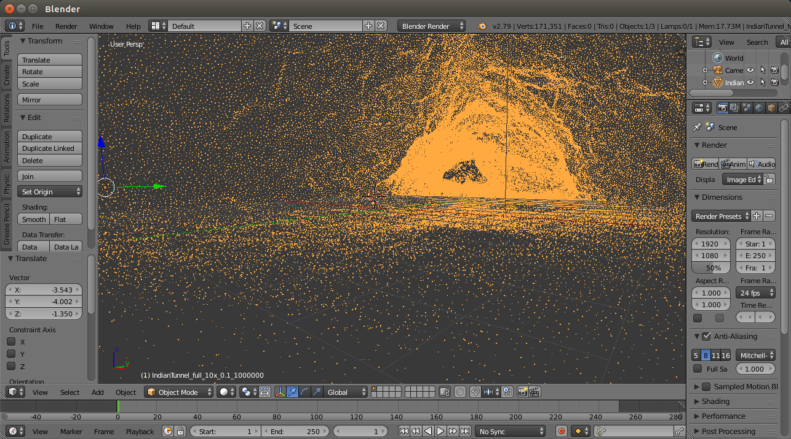
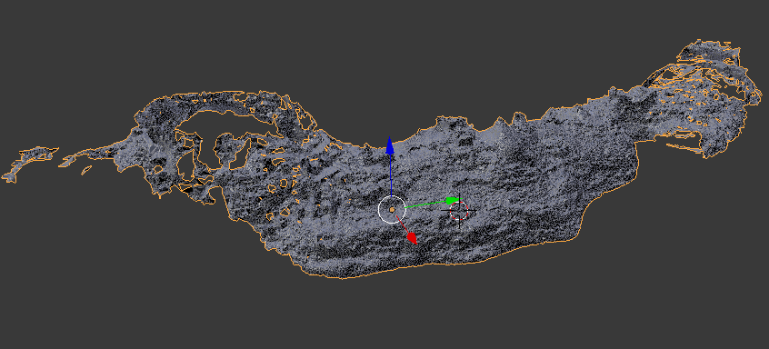
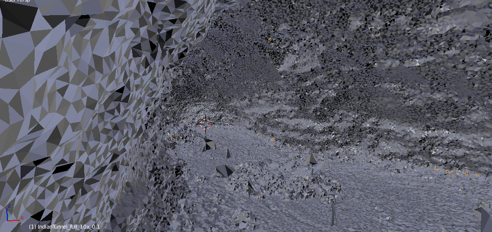
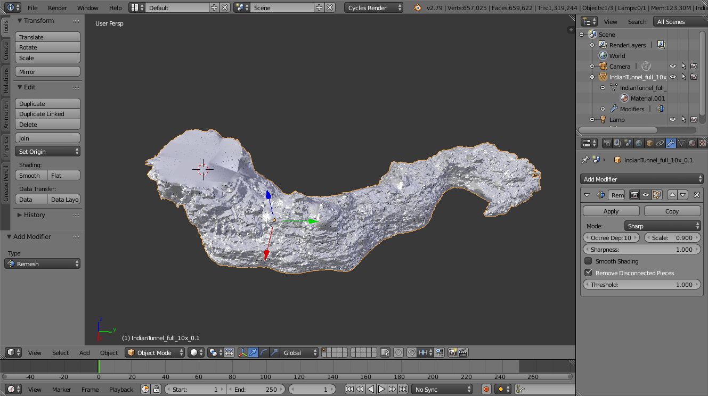
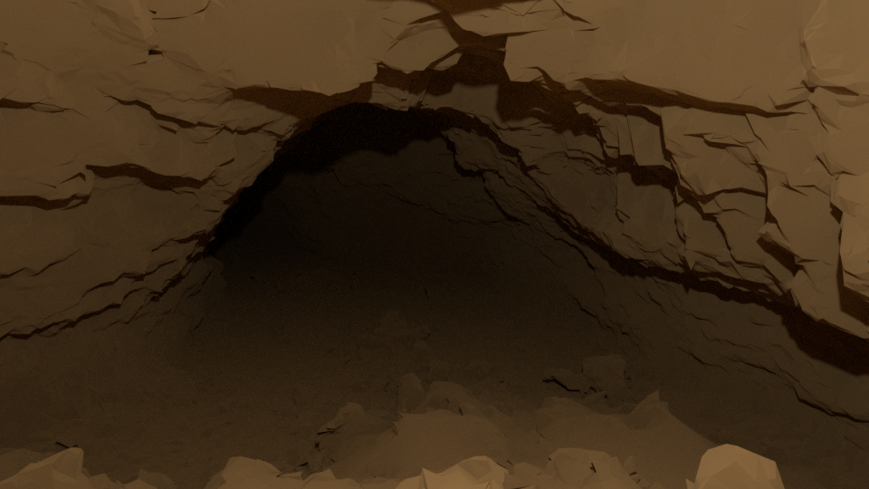
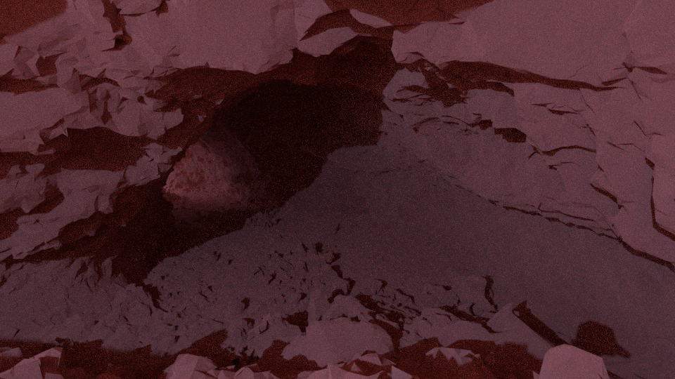
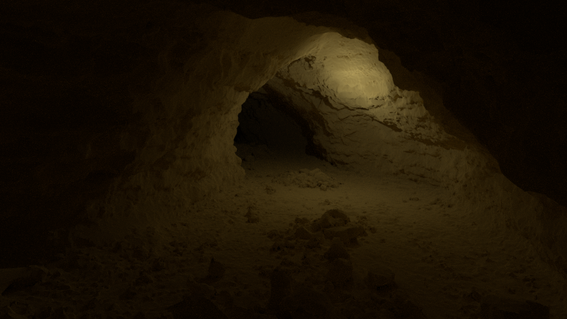
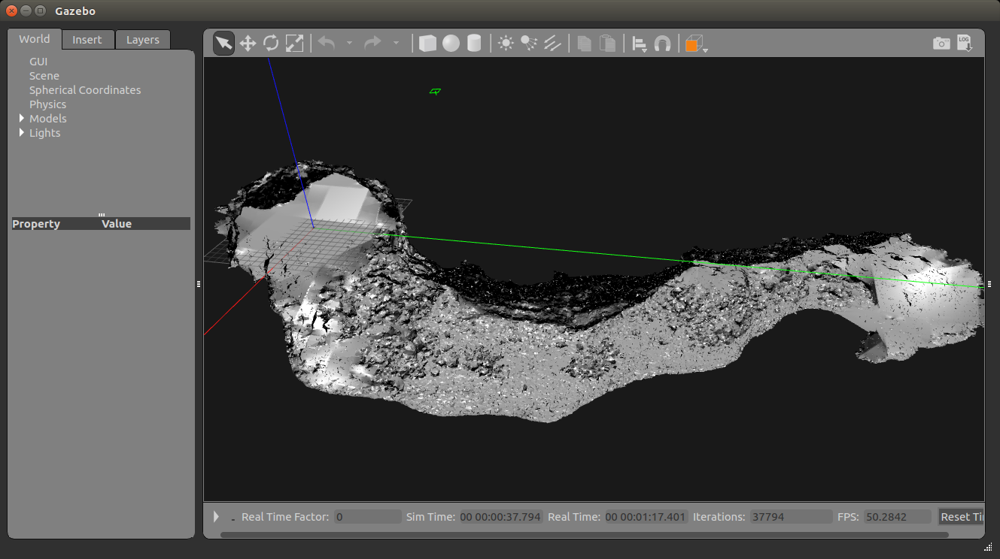

# What is this?

This includes my code to perform the Poisson sampling of point clouds, eliminating dense points which are close to each other in a specified radius.
The resulted data is down-sampled, yet keeping the details in sparse areas.


# Purpose
For my simulation projects ([quadrotor-tunnel-nav](https://github.com/tidota/quadrotor-tunnel-nav) and [mav-tunnel-nav](https://github.com/tidota/mav-tunnel-nav)), I made this repository to build a 3D mesh model from the raw data of a lava tube provided by CMU:
<S>http://www.frc.ri.cmu.edu/projects/NIAC_Caves/</S>. (Note: the page has been moved to NASA's website. It is now available at https://ti.arc.nasa.gov/dataset/caves/)

# Usage
I tested it only on Octave, but it should run on MatLab. For Octave, the packages 'io' and 'statistics' should be installed.
The function to be called is defined in this file.
- f32_to_ply.m

Here is an example of usage. The first parameter is the path to the input file (.f32 file), the second is the one to the output file (.ply file), and the last one is the radius (in meter).
```
f32_to_ply('../IndianTunnel_cave/Full/IndianTunnel_full_10x.f32','IndianTunnel_full_10x_0.1_simple.ply',0.1)
```

This code uses the MatLab code provided by CMU in order to read f32 files.
<S>http://www.frc.ri.cmu.edu/projects/NIAC_Caves/#_Code</S>
https://ti.arc.nasa.gov/dataset/caves/#_Code

The algorithm is (ridiculously) simple compared to the equivalent feature which can be found in the existing point cloud libraries. It repeatedly samples a point from the original data and searches the corresponding cell in a 3D table. If it does not finds neighbors or they are not located in the specified radius from the sample point, it registers the sampled point to both the list and table. Otherwise, the sampled point is discarded. Apparently, the more sophisticated ways employs octree instead of the table.

# To build a meshed model

## import a ply file
First, you need to "import" the ply file which contains the 3D point clouds in it.

## generate a basic mesh
Here is a python script running on Blender.
https://sourceforge.net/projects/pointcloudskin/

The result looks like this.



## refine the mesh
The resulted mesh lacks some walls and contains holes or openings. The remesh modifier re-models the mesh so that the model does not have a hole. The quality and details depend on the degree of octree. The higher degree, the more detailed. For computational efficiency, however, the degree is set to 10 here.


If the model is rendered, it would look like this.


This is the case that the model is remeshed with the highest degree of octree.


## Normals of Faces
Make sure that all surfaces faces inward.

## export the data as a collada file
Finally, export the data as a collada file (.dae).

After setting up a world file. The Gazebo will show this environment.

